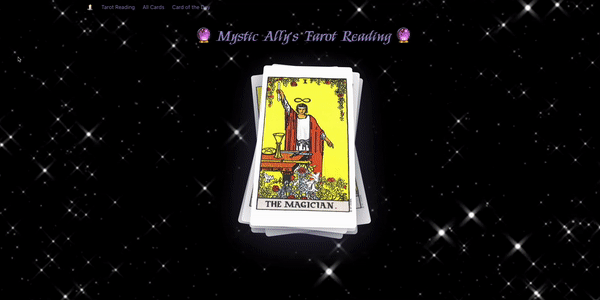
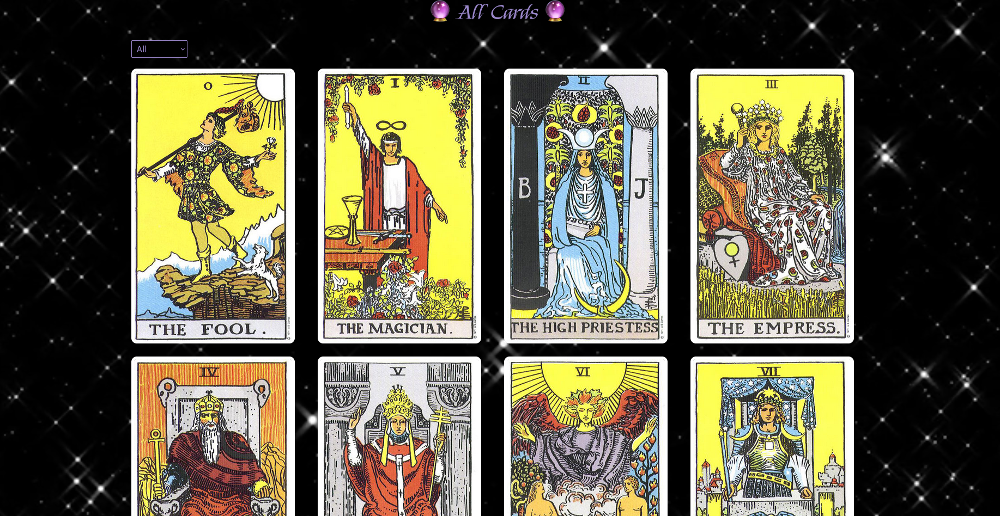
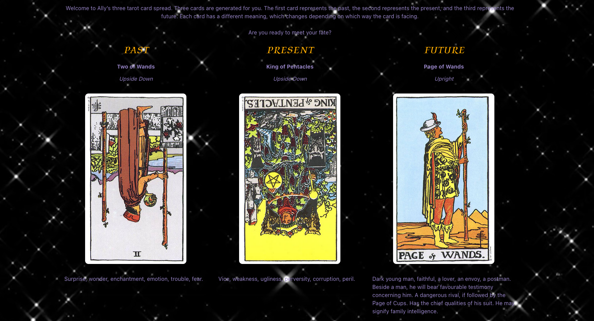

# Project 2 - Mystic Ally's Tarot Reading
## Overview
This was the second project as part of the General Assembly Software Engineering Immersive Course. This was a partner project which lasted 48 hours. We chose to create a tarot reading website.

## Brief
The brief was to create a react app using a public API over 48 hours.
### Technical Requirements
* Use React.js
* Consume a public API
* Have several Components
* Use Bulma as a CSS framework

### Installation
* Access the source code via the 'Clone or download' button
* Run ```npm i``` or ```npm install``` to install dependencies
* Run ```npm run dev``` to start the development server

## Built With
* HTML
* Bulma
* CSS
* SASS
* React.js
* JSX
* Axios
* React-Router-Dom
* Git
* GitHub
* Netlify
* [Tarot Card API](https://rws-cards-api.herokuapp.com/api/v1/cards/)

## Key Features
### Minimum Requirements
* Being able to get a standard 3-card spread tarot reading
* Viewing all the available tarot cards and what they mean
### Stretch Goals
* Having a 'card of the day' which would randomly generate a card every day
* Creating a home page with a component sourced online

## Deployed Version
[View the deployed version of the website](https://mystic-allys-tarot-reading.netlify.app/)



## Planning
### Choosing an API and Planning
We spent the first few hours of the project finding an API to use and planning our React app. After browsing a few public APIs we settled on a Tarot Card API to create an app that would provide a tarot reading for the user. We did some research on different card spreads and decided to do a simple 3-card spread due to the time constraints of the project.

### Pages
Firstly we decided what pages we wanted our app to have:
* Home page with information or a fun animation
* An index page where you can browse all possible cards and click them
* A show page for each card that gives details and meaning
* The 3-card spread reading page
* A 'card of the day' page as a stretch goal

## The Build
During the project we used Live Share on VSCode while working together on Zoom. In order to work as efficiently as possible we divided the build, coding separate components while discussing what we were working on and helping each other problem solve.

## Day 1
During the first day of the project we focused on the following elements:
* Setting up the app and components needed
* Creating our nav bar and URLs
* Importing the data from the API
* Home Page
* Index Page
* Card Show Page
* Card of the Day Page

### Home Page
One of the pages I focused on during the first day was the home page. I was able to find a pre-existing code-snippet online which showed an animation of a deck of tarot cards. One of my biggest wins during this project was being able to take this code and integrate it to our app, something which was new to me at the time.

## Index Page
My main focus on the first day however, was the Index Page. This page was to display all the tarot cards in the deck, sorted in order with each card linking to its own individual show page. When working on this page, we encountered two major issues: our API did not have any images and it did not have a single card end point.

We were able to get around the image issue by uploading the images to imgur and creating an object in a separate file ```images.js``` that contained links to the images on imgur, with keys that matched the ```name_short``` key of our API.

To address the end point issue we linked to ```/tarot/${card.name_short}``` on the index page and then used useParams and a filter to access the data from the API on the show page. Using the function below we were able to display the clicked-on card on its show page:
```js
const [cards, setCards] = React.useState([])
const { cardId } = useParams()

React.useEffect(() => {
  const getData = async () => {
    try {
      const res = await getAllCards()
      setCards(res.data.cards)
    } catch (err) {
      setIsError(err)
    }
  }
  getData()
}, [])

return (
  <>
    {cards.filter(card => card.name_short.includes(cardId)).map(filteredCard => ...
```
On the index page I also focused on creating a filter function, which proved challenging as all the 'Major' cards did not have a common key. I was able to bypass this using a simple if statement as shown below:
```js
  const filterCards = (cards) => {
    return cards.filter(card => {
      if (filterValue === 'All') {
        return cards
      } else if (filterValue === 'Major') {
        return card.type.toLowerCase().includes(filterValue.toLowerCase())
      } else {
        return card.name.toLowerCase().includes(filterValue.toLowerCase())
      }
    })
  }
```
Another issue we came across was that the cards on the page did not display in order and we used the below code snippet to sort them out:
```js
  const sortedCards = cards.sort(function(a, b) {
    return a.name_short.localeCompare(b.name_short)
  })
```


## Day 2
For the second and last day of the project, we focused on:
* The Tarot Reading Page
* Error Handling
* Debugging
* CSS

### Tarot Reading Page
In order to create our 3-card spread, we used the API's endpoint to request 3 random cards from the deck. For the API requests we set up a ```lib``` file and used Axios to get the data. We used an ```onClick``` event and conditional rendering to display the cards when the ```start reading``` button is clicked. In a tarot deck the cards have different meanings depending on their orientation. To deal with this we mapped through our original array and used the spread operator to create a new array with 2 more keys: ```time``` and ```isUp```. The value of ```isUp``` was a randomly generated Boolean value, then used in the JSX to determine which card meaning was displayed and the orientation of the card. This was changed by adding a class of ```flipped``` using a ternary operator as shown below:
```js
 const newReadingCards = readingCards.map((card, index) => {
    return {
      ...card,
      time: times[index],
      isUp: Boolean(Math.round(Math.random())),
    }
  })
```
```js
 
```


### Error Handling
We used error handling to display whether there was an error or whether the API was loading to improve our user experience. To do this we built an ```Error.js``` and a ```Loading.js``` component, containing tailored JSX to be displayed. In the files making API requests, we created a boolian called ```isError``` and set this in the catch block of our ```getData``` function. We then used conditional rendering to display the imported Error component. We similarly created an ```isLoading``` boolean variable which is true if there is no error and if the array that contains the data is empty. Once again, we used conditional rendering to display the imported component as shown below:
```js
const [cards, setCards] = React.useState([])
const [isError, setIsError] = React.useState(false)
const isLoading = (cards.length === 0) && !isError

React.useEffect(() => {
    const getData = async () => {
      try {
        const res = await getAllCards()
        setCards(res.data.cards)
      } catch (err) {
        setIsError(true)
      }
    }
    getData()
  }, [])

return (
  <>
    {isError && <Error />}
    {isLoading && <Loading />}
    {!isLoading && !isError && cards &&
```

### Bulma
Due to the time constraints of the project, we chose to use a CSS famework and we went with Bulma as it was one we were both familiar with at the time.

## Key Learnings
* Early on in the project I learned that you can always find a way around an issue as we did with the lack of images in our API and the lack of a single card endpoint
* I learned a lot from this project, especially in improving my skills using React, impoving my understanding of React-Router-Dom and using a public API
* As this was the first time I was working with someone on a project, I had to learn how to quickly adapt and use Live Share to code along. It was a joy working with Holly on this project and we worked really well together and had a lot of fun helping each other find solutions to our problems

## Future Improvements
* Add the card of the day to local storage so that it doesn't change every time the page refreshes